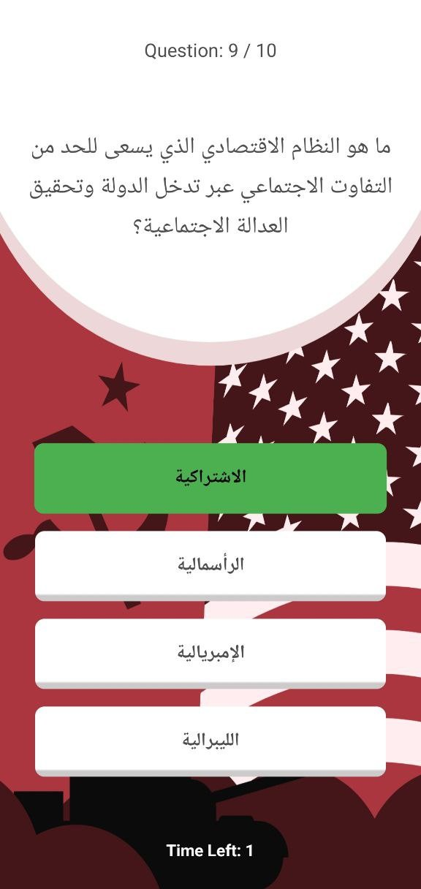

# a-helper-for-algerian-bac-students

> **A  solution designed to eliminate the logistical burdens of the Algerian Bac exam, allowing students to focus 100% on learning and leave the rest to us.**

---

## 📖 Project Overview

### The Preface
Preparing for the BAC exam in Algeria is often a battle against information overload. The primary challenge isn't just the difficulty of the material—it is the **process of acquiring, organizing, and filtering resources.** this is an app currently under active development, built by university students to solve this. We aim to take off the mental burden and stress by providing a centralized, "all-in-one" toolkit for the journey toward success.

---

## 🛠️ Features (The Student Toolkit)

### 1. 📝 Smart Notes Taker
A focused Markdown-enabled tool that allows students to capture essential information on the fly. We've moved beyond simple text to include visual organization:
* **Status Tracking:** Mark concepts as `Done` (strikethrough).
* **Urgency Levels:** Color-coded `Urgent` (Red) flags for topics needing immediate review.
* **Highlighting:** `Key Concepts` (Yellow) for easy scanning during final revisions.

> [Place a GIF or Image of the Notes Taker Interface Here]

### 2. 🧪 Automated Exam Generator
Finding practice material is usually a hassle. Our generator automates this process:
* **Subject Specific:** Generate exercises specifically for **Mathematics** and **Physics**.
* **Targeted Practice:** Filter by **Branch** (filière) and specific **Lessons**.
* **Instant Solutions:** Every generated exercise comes with its detailed solution, eliminating the search for answer keys.

> [Place a GIF or Image of the Exam Generation Process Here]

### 3. 🧠 Active Recall Quiz App
Designed for subjects requiring memorization, such as **Islamic Studies**, **History**, and **Geography**.
* **Self-Testing:** Turn passive reading into active recall.
* **Streamlined Content:** Questions focused on the official Algerian curriculum.
* **Gamify Memorization:**making the process fun and competative
> [Place a GIF or Image of a Quiz in Progress Here]
> | Quiz Interface |
> | :---: |
> | Geography Quiz | History Quiz |
> | :---: | :---: |
> |  |  |
---

## ⚙️ Technical Information

This app is engineered using modern cross-platform technologies to ensure a smooth experience on both Android and iOS.

* **Framework:** `React Native` (Expo)
* **Backend & Database:** `Appwrite` (Handling authentication and data persistence)
* **Content Hosting:** `GitHub` and integrated cloud services.
* **Architecture:** Modular component-based structure designed for scalability.

---

## 👥 Collaborators

We are a team of two university students dedicated to improving the Algerian educational landscape through technology.

* **[AbdelHADI Djillali/@hadihaha]** - 
* **[Akram Trad/@akr1am]** - 

---

## 🚀 Coming Soon
We are constantly iterating. Future updates will include:
- [ ] Integration for more subjects (Philosophy, Languages...).
- [ ] AI-driven study scheduling.
- [ ] Offline mode for students with limited internet access.

---
*Developed with ❤️ in Algeria for the next generation of graduates.*
